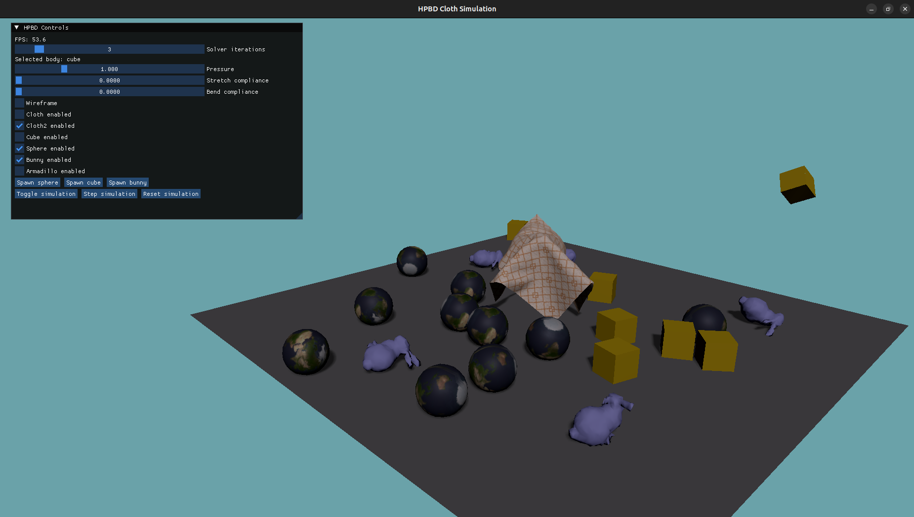
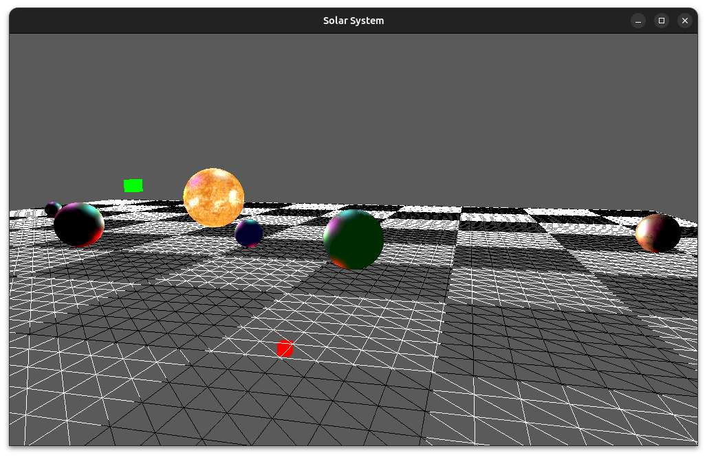

# Feather
 
Feather is a small OpenGL engine written in C++ developed for fun and learning purposes. The API is loosely inspired by BabylonJS.



## Features

### General

- Blinn-Phong shading
- PBR shading
- Normal mapping
- Shadow Mapping
- CPU mouse picking
- Post-processing effects
- Compute shaders
- Raw `.obj` file loading
- Up to 128 point lights by default
- ImGui integration

### Physics

The entire code for the physics engine is available in the `core/physics` directory. It is based on the Position-Based Dynamics (PBD) method, and includes the following features:

- XPBD soft body simulation
- HPBD multigrid solver for XPBD
- Distance constraints
- Fast and Dihedral bending constraints
- Tetrahedral volume constraints
- Global volume constraints
- Collision constraints with friction

### How to build

#### Dependencies

Feather uses GLFW3 for window management and input, as well as GLM for math operations.

They can be installed on any Debian-based system using the following command:

```bash
sudo apt install libglfw3-dev libglm-dev
```

#### CMake

Feather uses CMake as its build system. To build the project, you can use the following commands:

```bash
mkdir build
cd build
cmake ..
make
```


