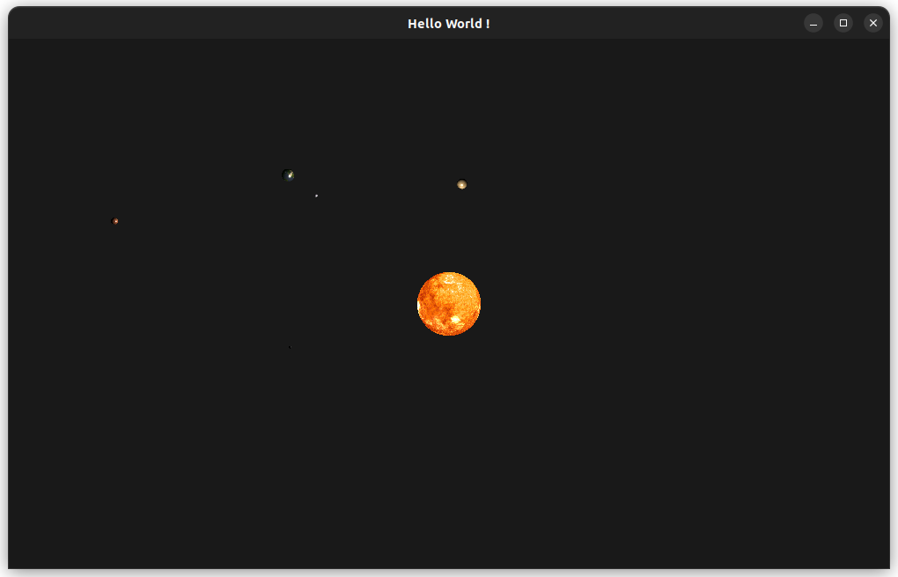
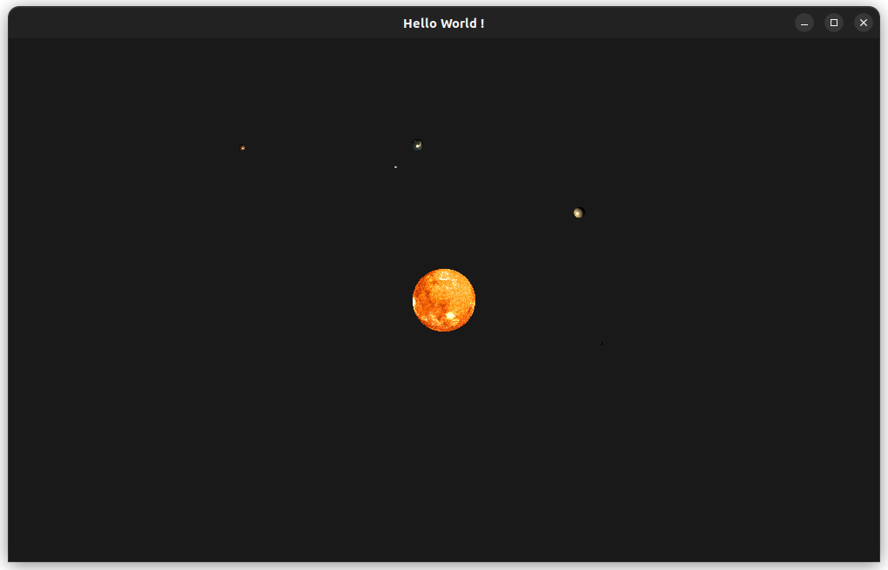
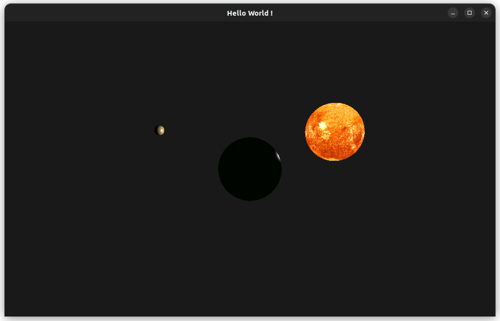

# Feather
 
Feather is a small opengl engine written in c++ inspired by BabylonJS aiming at easily create complex playgrounds for simulations.

It features a demo of a small simple solar system made using the engine.

